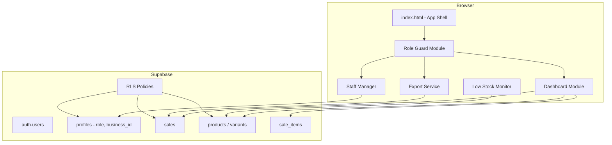

# Design Document: POS Security & Dashboard Upgrade

## Overview

This upgrade enhances the Marble POS system with five interconnected improvements: database-level role enforcement via Supabase RLS, a frontend role-guard system, a richer analytics dashboard, Excel/PDF export, automated low-stock notifications, and a mobile-optimized UI. All changes are additive and scoped to the existing multi-tenant `business_id` architecture.

The implementation is entirely in vanilla HTML/CSS/JS (no build step) with CDN-loaded libraries, consistent with the existing codebase.

---

## Architecture



The existing `currentUser` object (populated from `profiles` on login) carries `role` and `business_id`. All new modules read from this object — no additional auth calls are needed at runtime.

---

## Components and Interfaces

### 1. RLS Policies (SQL)

Applied in Supabase SQL editor. Uses a helper function to avoid repeated subqueries:

```sql
-- Helper: returns the role of the currently authenticated user
CREATE OR REPLACE FUNCTION get_my_role()
RETURNS TEXT LANGUAGE sql STABLE SECURITY DEFINER AS $$
  SELECT role FROM profiles WHERE id = auth.uid()
$$;

-- Helper: returns the business_id of the currently authenticated user
CREATE OR REPLACE FUNCTION get_my_business_id()
RETURNS UUID LANGUAGE sql STABLE SECURITY DEFINER AS $$
  SELECT business_id FROM profiles WHERE id = auth.uid()
$$;
```

Policy matrix:

| Table    | Operation | Allowed Roles          |
|----------|-----------|------------------------|
| sales    | SELECT    | all (own business_id)  |
| sales    | INSERT    | admin, cashier         |
| sales    | UPDATE    | admin                  |
| sales    | DELETE    | admin                  |
| products | SELECT    | all (own business_id)  |
| products | INSERT    | admin, manager         |
| products | UPDATE    | admin, manager         |
| products | DELETE    | admin                  |
| variants | SELECT    | all (own business_id)  |
| variants | INSERT    | admin, manager         |
| variants | UPDATE    | admin, manager         |
| profiles | SELECT    | own row + admin (same business) |

### 2. Role Guard Module

A lightweight JS module added to `index.html`. Runs after every `navigate()` call.

```js
// Interface
function applyRoleGuards(role) { /* hides/shows elements by data-role attribute */ }
```

HTML elements are annotated with `data-role-min="manager"` or `data-role-allow="admin,manager"`. The guard iterates all such elements and sets `display:none` or `disabled` based on the current role hierarchy:

```
viewer < cashier < manager < admin
```

### 3. Staff Manager Panel

A new section in the sidebar nav (admin-only). Renders inside `#mainContent` like other sections.

```js
// Interface
async function renderStaffManager()
async function inviteStaff(email, role)       // calls supabase.auth.admin.inviteUserByEmail via backend proxy
async function updateStaffRole(userId, role)  // updates profiles.role
async function loadStaffList()                // SELECT from profiles WHERE business_id = currentUser.business_id
```

The `inviteUserByEmail` call requires the service-role key, so it must go through the existing `backend/server.js` as a new endpoint `POST /invite-staff`.

### 4. Dashboard Module

Extends the existing `renderDashboard()` function.

```js
// New helpers
async function getKPIs()           // returns { todaySales, weekSales, lowStockCount }
async function getWeeklyRevenue()  // returns array[7] of { day, total }
async function getTopProducts()    // returns array[5] of { product_name, total_qty }
async function getLeaderboard()    // returns array of { cashier_name, total_amount }
function renderRevenueChart(data)  // creates/destroys Chart.js instance
```

Chart.js loaded via CDN: `https://cdn.jsdelivr.net/npm/chart.js`

### 5. Export Service

```js
// Interface
function exportToExcel(sales)   // uses SheetJS window.XLSX
function exportToPDF(sales)     // uses window.jspdf.jsPDF
```

Libraries loaded via CDN:
- SheetJS: `https://cdn.sheetjs.com/xlsx-latest/package/dist/xlsx.full.min.js`
- jsPDF: `https://cdnjs.cloudflare.com/ajax/libs/jspdf/2.5.1/jspdf.umd.min.js`

### 6. Low Stock Monitor

```js
// Interface
function startLowStockMonitor()   // sets up setInterval(checkLowStock, 5000)
function stopLowStockMonitor()    // clears interval
async function checkLowStock()    // queries variants, updates banner, fires push if new items
function renderNotificationBanner(items)
function requestPushPermission()  // called once on login for admin/manager
function sendPushNotification(newItems)
```

---

## Data Models

No new tables are required. The feature uses existing tables with the following relevant columns:

```
profiles:    id, full_name, role, business_id, plan
sales:       id, receipt_no, cashier_id, cashier_name, customer_name, total_amount, payment_method, date_str, business_id
sale_items:  id, sale_id, product_name, variant_id, qty, price
variants:    id, product_id, sku, qty, business_id
products:    id, name, business_id
```

The `business_id` column must exist on `sales`, `products`, and `variants`. If not already present, a migration adds it:

```sql
ALTER TABLE sales    ADD COLUMN IF NOT EXISTS business_id UUID REFERENCES profiles(business_id);
ALTER TABLE products ADD COLUMN IF NOT EXISTS business_id UUID;
ALTER TABLE variants ADD COLUMN IF NOT EXISTS business_id UUID;
```

### Backend: New Endpoint

```
POST /invite-staff
Body: { email: string, role: string, business_id: string }
Auth: Bearer token (validated server-side)
Response: { ok: true } | { error: string }
```

---

## Correctness Properties

*A property is a characteristic or behavior that should hold true across all valid executions of a system — essentially, a formal statement about what the system should do. Properties serve as the bridge between human-readable specifications and machine-verifiable correctness guarantees.*

### Property 1: RLS role enforcement is exhaustive

*For any* database operation (INSERT, UPDATE, DELETE) on a protected table, the operation should succeed if and only if the authenticated user's role is in the permitted set for that operation.

**Validates: Requirements 1.1, 1.2, 1.3**

### Property 2: RLS business_id isolation

*For any* SELECT query on a protected table, the returned rows should contain only rows whose `business_id` matches the authenticated user's `business_id` — no rows from other businesses should be visible.

**Validates: Requirements 1.4**

### Property 3: Role guard visibility is role-determined

*For any* page navigation and any user role, the set of visible UI elements after `applyRoleGuards()` should be exactly the set permitted for that role — no more, no less.

**Validates: Requirements 2.1, 2.2, 2.3, 2.4, 2.5**

### Property 4: Role guard is idempotent

*For any* role, calling `applyRoleGuards(role)` multiple times in succession should produce the same DOM state as calling it once.

**Validates: Requirements 2.6**

### Property 5: Staff list is business-scoped

*For any* admin user, the staff list rendered by `loadStaffList()` should contain only profiles whose `business_id` matches the admin's `business_id`.

**Validates: Requirements 3.4**

### Property 6: KPI card sums are correct

*For any* set of sales records with known `total_amount` and `date_str` values, the KPI card values returned by `getKPIs()` should equal the arithmetic sum of `total_amount` for records matching the date filter (today or current week).

**Validates: Requirements 4.1, 4.2, 4.3**

### Property 7: Weekly revenue chart data matches sales aggregation

*For any* set of sales records, the array returned by `getWeeklyRevenue()` should have exactly 7 entries (one per day Mon–Sun), and each entry's `total` should equal the sum of `total_amount` for sales on that day (zero if no sales).

**Validates: Requirements 5.1, 5.2, 5.3**

### Property 8: Top products ranking is correct

*For any* set of `sale_items` records, the array returned by `getTopProducts()` should be ordered by total quantity descending, contain at most 5 entries, and each entry's `total_qty` should equal the sum of `qty` for that `product_name`.

**Validates: Requirements 6.1, 6.2, 6.3**

### Property 9: Leaderboard ranking is correct

*For any* set of sales records, the array returned by `getLeaderboard()` should be ordered by total amount descending, and each entry's `total_amount` should equal the sum of `total_amount` for that `cashier_name`.

**Validates: Requirements 7.1, 7.2**

### Property 10: Excel export contains all sales rows with correct columns

*For any* set of sales records, the workbook generated by `exportToExcel(sales)` should contain exactly one sheet with a header row matching the required columns and one data row per sale record, with values matching the source data.

**Validates: Requirements 8.1, 8.2**

### Property 11: PDF export contains all sales rows with correct header

*For any* set of sales records, the document generated by `exportToPDF(sales)` should include the business name, export date, total sales amount, and one row per sale record.

**Validates: Requirements 9.1, 9.2, 9.3**

### Property 12: Notification banner reflects current low-stock state

*For any* list of variants returned by the low-stock query, the `renderNotificationBanner(items)` function should display exactly those items — no more, no fewer — and the banner should be hidden when the list is empty.

**Validates: Requirements 10.2, 10.3, 10.4**

### Property 13: Push notification fires only for newly low-stock items

*For any* two consecutive poll results (previous and current), a push notification should be sent if and only if there are items in the current result that were not in the previous result (new low-stock items).

**Validates: Requirements 11.2**

---

## Error Handling

| Scenario | Handling |
|---|---|
| RLS rejects a write | Frontend catches Supabase error, shows toast with "Permission denied" |
| Staff invite email already exists | Backend returns 409, frontend shows inline error |
| Chart.js canvas reuse | Destroy existing chart instance before `new Chart()` |
| Low-stock poll fails | `console.error`, interval continues |
| Export with empty sales | Show toast "No data to export", skip file generation |
| Push notification permission denied | Set session flag, never prompt again |
| `business_id` missing on profile | Redirect to onboarding flow (existing behavior) |

---

## Testing Strategy

### Dual Testing Approach

Both unit tests and property-based tests are used. Unit tests cover specific examples, edge cases, and integration points. Property tests verify universal correctness across randomized inputs.

**Property-Based Testing Library**: [fast-check](https://github.com/dubzzz/fast-check) (loaded via CDN or npm in a test harness). Minimum 100 iterations per property test.

**Unit Testing**: Plain JS test functions or Jest for the pure logic modules (KPI aggregation, export formatting, role guard logic).

### Property Test Tags

Each property test must be tagged:
`Feature: pos-security-dashboard-upgrade, Property N: <property_text>`

### Test Coverage Plan

| Property | Test Type | Module Under Test |
|---|---|---|
| P1: RLS role enforcement | Integration (Supabase test project) | RLS SQL policies |
| P2: RLS business_id isolation | Integration | RLS SQL policies |
| P3: Role guard visibility | Property (fast-check) | `applyRoleGuards()` |
| P4: Role guard idempotence | Property (fast-check) | `applyRoleGuards()` |
| P5: Staff list scoped | Property (fast-check) | `loadStaffList()` mock |
| P6: KPI sums correct | Property (fast-check) | `getKPIs()` pure logic |
| P7: Weekly revenue correct | Property (fast-check) | `getWeeklyRevenue()` |
| P8: Top products correct | Property (fast-check) | `getTopProducts()` |
| P9: Leaderboard correct | Property (fast-check) | `getLeaderboard()` |
| P10: Excel export rows | Property (fast-check) | `exportToExcel()` |
| P11: PDF export content | Property (fast-check) | `exportToPDF()` |
| P12: Banner reflects state | Property (fast-check) | `renderNotificationBanner()` |
| P13: Push only for new items | Property (fast-check) | `checkLowStock()` diff logic |

### Unit Test Cases

- Role guard: cashier sees no Reports nav item (example)
- Role guard: admin sees all nav items (example)
- KPI card: zero sales returns K0.00 (edge case)
- Weekly chart: day with no sales shows 0 (edge case)
- Top products: fewer than 5 products shows only available (edge case)
- Leaderboard: empty sales shows empty state (edge case)
- Export: empty sales array shows toast, no download (edge case)
- Low-stock monitor: query error logs and continues (edge case)
- Push notification: denied permission skips notification (edge case)
- Chart: re-navigation destroys previous instance (example)
